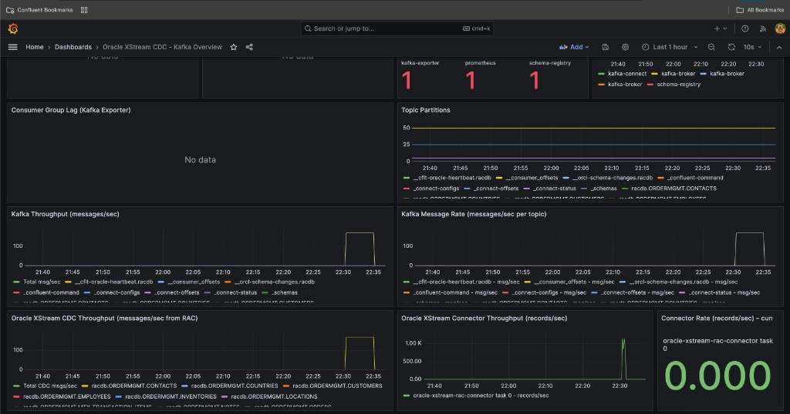

# Oracle RAC on OCI with Kafka XStream CDC Pipeline

A self-managed Oracle CDC (Change Data Capture) pipeline using the **Confluent Oracle XStream CDC Connector**, streaming changes from **Oracle RAC on OCI DB System** to **Apache Kafka**. All infrastructure runs on **Oracle Cloud Infrastructure (OCI)**.

[](LICENSE)

---

## Table of Contents

- [Architecture Overview](#architecture-overview)
- [Environment Overview](#environment-overview)
- [Quick Start](#quick-start)
- [Project Structure](#project-structure)
- [Validation](#validation)
- [Oracle Database](#oracle-database)
- [Demo: End-to-End Flow](#demo-end-to-end-flow)
- [Screenshot](#screenshot)
- [Troubleshooting](#troubleshooting)
- [Prerequisites](#prerequisites)
- [License](#license)
- [About the Screenshot](#about-the-screenshot)
- [References](#references)

---

## Architecture Overview

```
┌──────────────────────────────────────────────────────────────────────────────────┐
│  OCI                                                                              │
│                                                                                   │
│  ┌──────────────────────────┐         ┌────────────────────────────────────────┐  │
│  │  Oracle RAC              │         │  Connector VM (Docker)                  │  │
│  │  SCAN: racdb-scan...      │  LCR   │                                         │  │
│  │                           │ ─────► │  • 3-Broker Kafka (KRaft)               │  │
│  │  • XStream Out outbound   │  1521  │  • Kafka Connect + Oracle XStream CDC   │  │
│  │  • Supplemental logging  │         │  • Schema Registry                      │  │
│  │  • ORDERMGMT schema       │         │  • Grafana, Prometheus,                │  │
│  │  • CDC load scripts       │         │    Kafka Exporter                       │  │
│  └──────────────────────────┘         └────────────────────────────────────────┘  │
│           │                                          │                             │
│           │ sqlplus (load scripts)                   │ racdb.ORDERMGMT.* topics     │
│           ▼                                          ▼                             │
│  ┌──────────────────────────┐         ┌────────────────────────────────────────┐  │
│  │  Oracle host              │         │  Kafka topics (CDC events)              │  │
│  │  Load scripts, unlock     │         │  Consumers / downstream apps            │  │
│  └──────────────────────────┘         └────────────────────────────────────────┘  │
└──────────────────────────────────────────────────────────────────────────────────┘

Data flow: Oracle DML → Redo → XStream Out (LCR) → Connector → Kafka Topics (JSON)
```

See [docs/ARCHITECTURE.md](docs/ARCHITECTURE.md) for a Lucidchart-style diagram description and network components.

---

## Environment Overview

| Item | Value |
|------|-------|
| **Cloud provider** | Oracle Cloud Infrastructure (OCI) |
| **Oracle RAC** | OCI DB System (Managed); 19c or 21c |
| **Connector VM** | OCI Compute; Oracle Linux 9; VM.Standard.E4.Flex (4 OCPUs, 16 GB) |
| **Kafka** | Apache Kafka 3.x (Confluent Platform 7.9) on Docker |

**Provisioning guides:**
- [Oracle RAC on OCI](https://docs.oracle.com/en/cloud/paas/db-shared/create-dbcs.html) – Create DB System
- [docs/OCI-VM-SETUP.md](docs/OCI-VM-SETUP.md) – VCN, subnet, compute VM, security rules
- [docs/OCI-DB-SYSTEM-SETUP.md](docs/OCI-DB-SYSTEM-SETUP.md) – DB System configuration reference (screenshots with sensitive data masked)

---

## Quick Start

| Step | Action |
|------|--------|
| 1 | SSH to VM: `ssh -i key.pem opc@<vm-ip>` |
| 2 | Copy project: `scp -r oracle-xstream-cdc-poc opc@<vm-ip>:/home/opc/` |
| 3 | Install Docker (if needed): `sudo ./docker/scripts/install-docker.sh` |
| 4 | Configure: `cp docker/.env.example docker/.env` and set `ORACLE_INSTANTCLIENT_PATH` |
| 5 | Connector config: `cp xstream-connector/oracle-xstream-rac-docker.json.example xstream-connector/oracle-xstream-rac-docker.json` — edit `database.password`, `database.hostname`, `database.service.name` |
| 6 | **Bring up:** `./docker/scripts/bring-up.sh` (full stack + monitoring + connector) |
| 7 | **Verify (on VM):** `curl -s http://localhost:8083/connectors/oracle-xstream-rac-connector/status | jq .` |
|   | **Verify (from Mac):** `./status <vm-ip>` or `./scripts/status-from-mac.sh <vm-ip>` |

**Detailed guides:**
- [docs/ARCHITECTURE.md](docs/ARCHITECTURE.md) – Architecture diagram, network components
- [docs/OCI-VM-SETUP.md](docs/OCI-VM-SETUP.md) – VCN, subnet, VM, security rules
- [docs/IMPLEMENTATION-GUIDE.md](docs/IMPLEMENTATION-GUIDE.md) – **Complete end-to-end implementation guide**
- [docs/EXECUTION-GUIDE.md](docs/EXECUTION-GUIDE.md) – Full setup commands
- [docs/VALIDATION.md](docs/VALIDATION.md) – RAC status check, validation steps
- [docs/STATUS-CHECK.md](docs/STATUS-CHECK.md) – **Connector, Kafka, Prometheus, Grafana status checks** (step-by-step)
- [docs/DEMO.md](docs/DEMO.md) – Step-by-step live demo script
- [monitoring/README.md](monitoring/README.md) – **Monitoring setup** (Grafana, Prometheus, JMX exporters)
- [load-testing/README.md](load-testing/README.md) – **Load testing** (Kafka → Flink throughput, step tests)
- [docs/PERFORMANCE-OPTIMIZATION.md](docs/PERFORMANCE-OPTIMIZATION.md) – **Ultra high-throughput tuning** (connector, JVM, GC, serialization) — validated **>10K records/sec** on 500K load

### Demo Flow (5 steps)

1. **Oracle** – Run SQL scripts 01→06 in `oracle-database/` to enable XStream and create outbound server  
2. **VM** – Install Docker, extract Oracle Instant Client to `/opt/oracle/instantclient/instantclient_19_30`  
3. **Connector** – Copy `oracle-xstream-rac-docker.json.example` → `oracle-xstream-rac-docker.json` and set credentials  
4. **Start** – Run `./docker/scripts/start-docker-cluster.sh`, `precreate-topics.sh`, `complete-migration-on-vm.sh`  
5. **Verify** – Insert into `ORDERMGMT.MTX_TRANSACTION_ITEMS`, consume from Kafka topic `racdb.ORDERMGMT.MTX_TRANSACTION_ITEMS`

---

## Project Structure

```
oracle-xstream-cdc-poc/
├── README.md
├── docker/                         # 3-broker Kafka cluster (primary)
│   ├── docker-compose.yml
│   ├── docker-compose.monitoring.yml
│   ├── Dockerfile.connect
│   ├── .env.example
│   ├── xstream-connector-docker.json.example
│   └── scripts/
│       ├── start-docker-cluster.sh
│       ├── stop-docker-cluster.sh
│       ├── precreate-topics.sh
│       ├── deploy-connector.sh
│       ├── complete-migration-on-vm.sh
│       ├── increase-rf-to-3.sh
│       └── install-docker.sh
├── oracle-database/                # SQL scripts (run 01→14 in order)
│   ├── 01-14*.sql                  # Schema, XStream, outbound, verification
│   ├── tnsnames.ora.example        # TNS template (copy to tnsnames.ora)
│   ├── 15-generate-cdc-throughput.sql
│   ├── 16-generate-heavy-cdc-load.sql
│   ├── run-generate-cdc-throughput.sh
│   ├── run-generate-heavy-cdc-load.sh
│   └── unlock-ordermgmt.sh         # Unlock ordermgmt (requires SYSDBA_PWD, NEW_ORDMGMT_PWD)
├── xstream-connector/              # Connector config
│   ├── README.md
│   ├── oracle-xstream-rac-docker.json.example
│   └── oracle-xstream-rac-connector.properties.example
├── monitoring/                     # Monitoring stack (optional)
│   ├── README.md
│   ├── jmx/                        # JMX Exporter configs
│   ├── prometheus/                 # Prometheus config + alerts
│   ├── grafana/                    # Dashboards + provisioning
│   ├── docs/                       # GRAFANA-DASHBOARD-README, CDC-THROUGHPUT-METRICS
│   └── scripts/
├── load-testing/                   # Kafka throughput load testing
│   ├── README.md
│   └── scripts/
├── troubleshooting/
│   └── TROUBLESHOOTING.md
├── screenshots/
│   ├── README.md
│   ├── grafana-cdc-overview.png
│   ├── oci-db-system-info.png         # OCI DB System (redacted)
│   └── oci-db-system-nodes.png       # OCI RAC nodes (redacted)
└── docs/
    ├── ARCHITECTURE.md            # Diagram, Environment Overview, network
    ├── OCI-VM-SETUP.md            # VCN, subnet, VM, security rules
    ├── OCI-DB-SYSTEM-SETUP.md     # DB System config reference (masked screenshots)
    ├── VALIDATION.md              # RAC status check
    ├── IMPLEMENTATION-GUIDE.md
    ├── EXECUTION-GUIDE.md
    ├── DEMO.md
    └── PERFORMANCE-OPTIMIZATION.md
```

---

## Validation

Before configuring the connector, verify Oracle RAC is healthy. See [docs/VALIDATION.md](docs/VALIDATION.md) for details.

**RAC status (run as `grid` on RAC node):**
```bash
# Script: https://github.com/guestart/Linux-Shell-Scripts/blob/master/check_rac_res/check_rac_res_status.sh
./check_rac_res_status.sh
```

**Connector status:**
```bash
curl -s http://localhost:8083/connectors/oracle-xstream-rac-connector/status | jq .
```

---

## Oracle RAC on OCI DB System

The Oracle RAC database runs on **OCI DB System** (managed). It must have XStream enabled and the outbound server configured.

**Provisioning:** See [Create Oracle Base Database (DB System)](https://docs.oracle.com/en/cloud/paas/db-shared/create-dbcs.html). For RAC, use a RAC-enabled shape. Prerequisites: Oracle 19c or 21c, ARCHIVELOG mode.

**Version:** 19c or 21c Enterprise Edition. XStream requires `enable_goldengate_replication=TRUE`.

Run the SQL scripts in [oracle-database/](oracle-database/) **in order** (01 → 14).

### Prerequisites

| Requirement | Check |
|-------------|-------|
| Oracle 19c/21c Enterprise/Standard | `SELECT * FROM v$version;` |
| ARCHIVELOG mode | `SELECT LOG_MODE FROM V$DATABASE;` |
| XStream enabled | `SELECT VALUE FROM V$PARAMETER WHERE NAME = 'enable_goldengate_replication';` |

### Script Execution Order

| # | Script | Purpose |
|---|--------|---------|
| 01 | `01-create-sample-schema.sql` | ORDERMGMT schema and tables |
| 02 | `02-enable-xstream.sql` | Enable XStream replication |
| 03 | `03-supplemental-logging.sql` | Supplemental logging |
| 04 | `04-create-xstream-users.sql` | XStream admin and connect users |
| 05 | `05-load-sample-data.sql` | Sample data |
| 06 | `06-create-outbound-ordermgmt.sql` | XStream Out outbound server |
| 07–14 | See [oracle-database/README.md](oracle-database/README.md) | Verification, teardown, onboarding |

---

## Demo: End-to-End Flow

### 1. Insert Data into Oracle

```sql
INSERT INTO ORDERMGMT.MTX_TRANSACTION_ITEMS (
  TRANSFER_ID, PARTY_ID, USER_TYPE, ENTRY_TYPE, ACCOUNT_ID,
  TRANSFER_DATE, TRANSACTION_TYPE, SECOND_PARTY, PROVIDER_ID,
  TXN_SEQUENCE_NUMBER, PAYMENT_TYPE_ID, SECOND_PARTY_PROVIDER_ID, UNIQUE_SEQ_NUMBER,
  REQUESTED_VALUE, APPROVED_VALUE, TRANSFER_STATUS, USER_NAME
) VALUES (
  'TRF001', 'P001', 'REG', 'DR', 'ACC001',
  SYSDATE, 'TRANS', 'P002', 1,
  1001, 1, 1, 'SEQ-MTX-001-' || TO_CHAR(SYSDATE,'YYYYMMDDHH24MISS'),
  1000, 1000, 'COM', 'DemoUser'
);
COMMIT;
```

### 2. Consume from Kafka (after 10–30 seconds)

```bash
docker exec kafka2 kafka-console-consumer \
  --bootstrap-server kafka1:29092,kafka2:29092,kafka3:29092 \
  --topic racdb.ORDERMGMT.MTX_TRANSACTION_ITEMS \
  --from-beginning --max-messages 5
```

Expected: Debezium JSON with `"op":"c"` (create/INSERT), `"after"` with row data.

---

## Screenshot



---

## Troubleshooting

See [troubleshooting/TROUBLESHOOTING.md](troubleshooting/TROUBLESHOOTING.md).

**Common errors:**

| Error | Cause | Fix |
|-------|-------|-----|
| **ORA-12514** | XStream service name changed | Query `gv$SERVICES` for `network_name`, update `database.service.name` |
| **ORA-28000** | ordermgmt locked | Run `unlock-ordermgmt.sh` with SYSDBA_PWD, NEW_ORDMGMT_PWD |
| **Connection reset** | Connect not ready or Oracle JARs missing | Wait 60s; verify `ojdbc8.jar`, `xstreams.jar` in connector lib |
| **No suitable driver (OCI)** | LD_LIBRARY_PATH or JARs | Check connect-entrypoint.sh, Instant Client mount |
| **Connector FAILED** | DB connectivity, user, service | Inspect `trace` in status response |
| **Connection to node 1/3** | Wrong bootstrap | Use `kafka1:29092,kafka2:29092,kafka3:29092` (not localhost) |

### RAC Validation

To verify RAC cluster health (run as `grid` user on a RAC node):

```bash
# Use script from: https://github.com/guestart/Linux-Shell-Scripts/blob/master/check_rac_res/check_rac_res_status.sh
./check_rac_res_status.sh
```

**Expected output:** Node list, ASM UP, diskgroups MOUNTED, VIP/SCAN/Listener RUNNING. If any component shows DOWN, fix RAC before proceeding.

### Status Commands

```bash
# Containers
docker ps --format '{{.Names}}: {{.Status}}' | grep -E 'kafka|connect|schema'

# Connector
curl -s http://localhost:8083/connectors/oracle-xstream-rac-connector/status | jq .

# Topics
docker exec kafka2 kafka-topics --bootstrap-server kafka1:29092,kafka2:29092,kafka3:29092 --list | grep racdb
```

---

## Prerequisites

**Checklist before starting:**

| Item | Check |
|------|-------|
| OCI tenancy | Compute + DB System access |
| Oracle RAC | OCI DB System, 19c/21c, ARCHIVELOG |
| XStream enabled | `SELECT VALUE FROM V$PARAMETER WHERE NAME='enable_goldengate_replication'` = TRUE |
| Connector VM | Oracle Linux 9, 4+ OCPUs, 16+ GB RAM |
| Docker + Compose | `docker --version`, `docker compose version` |
| Oracle Instant Client | Basic + SQL*Plus at path in `docker/.env` |
| Network | VM can reach RAC SCAN on port 1521 |

---

## License

This project is licensed under the [Apache License 2.0](LICENSE).

**Note:** The Oracle XStream CDC connector is a Confluent Premium connector. A 30-day trial is available for POC.

---

## About the Screenshot

The screenshot above shows the **Oracle XStream CDC – Kafka Overview** Grafana dashboard in action. It captures real-time performance metrics for the CDC pipeline streaming changes from Oracle RAC to Kafka.

**What it shows:** Time-series panels for system health (kafka-exporter, Prometheus, schema-registry), topic partitions, Kafka throughput (messages/sec), Oracle XStream CDC throughput from RAC, and the Oracle XStream Connector throughput (records/sec). The synchronized spikes around 22:30 demonstrate successful end-to-end flow after a heavy-load insert test.

**Key features visible:**
- **Kafka Throughput** and **Oracle XStream CDC Throughput** show message rate into CDC topics.
- **Oracle XStream Connector Throughput** shows records/sec (validated **>10K records/sec** on 500K-row load with optimizations).
- **Topic Partitions** and **Connector Rate (current)** panels help monitor steady-state vs. burst activity.

**Context:** This dashboard is part of the optional monitoring stack (see [monitoring/README.md](monitoring/README.md)). Run the heavy-load script (`oracle-database/run-generate-heavy-cdc-load.sh 500000`) to generate throughput spikes. See [docs/PERFORMANCE-OPTIMIZATION.md](docs/PERFORMANCE-OPTIMIZATION.md) for tuning and validated results.

---

## References

- [Confluent Oracle XStream CDC Connector](https://docs.confluent.io/kafka-connectors/oracle-xstream-cdc-source/current/overview.html)
- [Oracle XStream Out Configuration](https://docs.oracle.com/en/database/oracle/oracle-database/19/xstrm/configuring-xstream-out.html)
